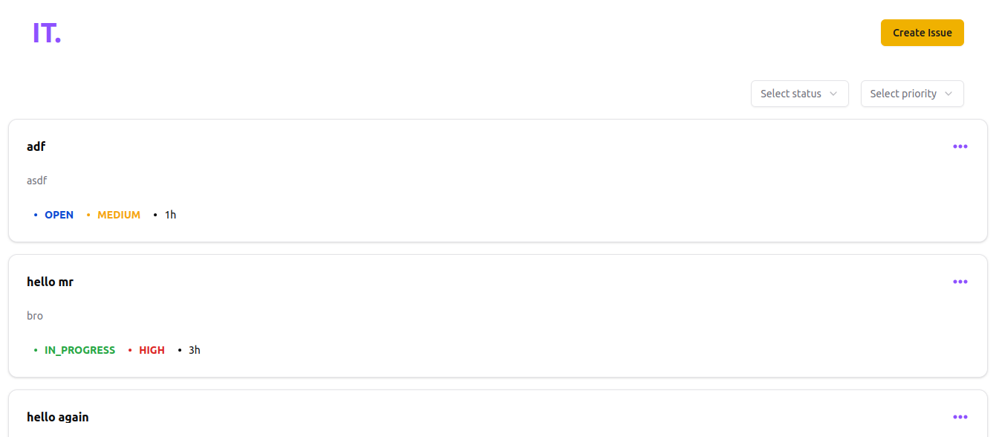

# 🐞 Issue Tracker Application

A full-featured Issue Tracker web application built with **React.js** for the frontend and **Node.js with Express** for the backend. This application enables users to create, view, edit, and delete software issues/bugs efficiently.

---

## Live Demo

You can view the live version of the application at:

[See Live](https://issue-tracker-flax-alpha.vercel.app)

## Screenshots



---

## 📌 Project Overview

This Issue Tracker provides developers and teams with a robust system to manage software issues and bugs. The platform includes:

- **Dashboard** with a list of all issues
- **Detailed View** for each issue
- Full **CRUD** functionality
- **Sorting & Filtering** capabilities
- Responsive and professional **UI**
- RESTful **API** with data persistence

---

## 🛠️ Technologies Used

- **Frontend**: React.js, React Router, Tailwind CSS
- **Backend**: Node.js, Express.js
- **Database**: PostgreSQL
- **Others**: Axios, ESLint, Prettier, dotenv

---

## Folder Structure

```

issue-tracker/

│── backend/   # Backend (Node.js + Express + TypeScript + MongoDB)

│── frontend/   # Frontend (Next.js + TailwindCSS + TypeScript)

│── README.md

```

## Getting Started

Follow the instructions below to set up the project locally.

### Prerequisites

Make sure you have the following installed:

- [Node.js](https://nodejs.org/) (v14.x or higher)
- [npm](https://www.npmjs.com/)

### Installation

#### 1. Clone the repository

```bash

git clone https://github.com/whogoodluck/issue-tracker

cd issue-tracker

```

#### 2. Setup the backend (server)

```bash

cd backend

npm install

```

#### 3. Configure environment variables

- Create a `.env` file inside the `backend/` folder

- Add the following:

  ```env

  PORT = 3001

  POSTGRES_URL = <your-postgres-db-url>

  ```

#### 4. Start the backend server

```bash

npm run dev

```

The backend will run on `http://localhost:3001`

#### 5. Setup the frontend (client)

```bash

cd ../frontend

npm install

```

#### 3. Configure environment variables

- Create a `.env` file inside the `frontend/` folder

- Add the following:

  ```env

  VITE_API_URL = http://localhost:3001

  ```

#### 6. Start the frontend server

```bash

npm run dev

```

The frontend will be available at `http://localhost:5173`
